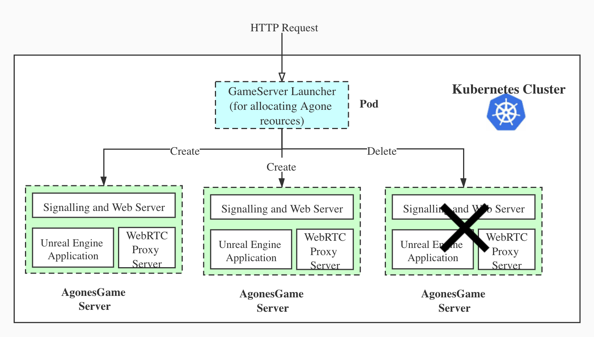
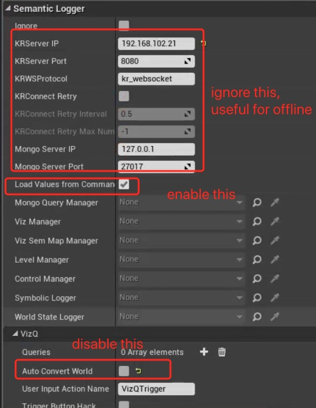
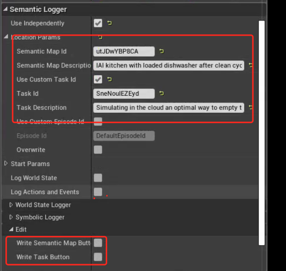

# CloudSim

## Introduction to CloudSim

CloudSim is a robot simulation system that is deployed on the Kubernetes cluster. In CloudSim, an Unreal Engine Pixel Streaming application represents a virtual environment for executing the simulation. CloudSim allows running multiple independent simulation simtanously by creating multiple Pixel Streaming applications in the clusters. Each Pixel Streaming application can be considered as a simulation instance. User can create the simualtion instances via HTTP service on demand.

The following image shows how CloudSim works. A GameServer Launcher is reponsible for creating and closing the Unreal Eninge Pixel Streaming applications in the cluster. Each Unreal Eninge Pixel Streaming application is wrap as an Agones GameServn r. A Pixel Streaming application is composed of three components, Unreal Engine application, WebRTC Proxy Server,  Signalling and Web Server.

- 


## CloudSim Cluster Setup (On Linux)

The CloudSim is deployed on Kubernetes cluster with Agones. In this part, it's focus on setting up a Kubernetes cluster   and Agones as well as some other components (mongodb, gs-launcher)

### Setting up Kubernetes cluster

#### Install Docker

https://docs.docker.com/engine/install/ubuntu/

```
 sudo apt-get update
 sudo apt-get install \
    apt-transport-https \
    ca-certificates \
    curl \
    gnupg \
    lsb-release

curl -fsSL https://download.docker.com/linux/ubuntu/gpg | sudo gpg --dearmor -o /usr/share/keyrings/docker-archive-keyring.gpg

echo \
  "deb [arch=amd64 signed-by=/usr/share/keyrings/docker-archive-keyring.gpg] https://download.docker.com/linux/ubuntu \
  $(lsb_release -cs) stable" | sudo tee /etc/apt/sources.list.d/docker.list > /dev/null
  
 sudo apt-get update
 sudo apt-get install docker-ce docker-ce-cli containerd.io
```


#### Install kubeadm

https://kubernetes.io/docs/setup/production-environment/tools/kubeadm/create-cluster-kubeadm/

(or https://agones.dev/site/docs/installation/creating-cluster/)

Install kubectl, kubeadm and kubelet (https://kubernetes.io/docs/setup/production-environment/tools/kubeadm/install-kubeadm/)

```
sudo apt-get update && sudo apt-get install -y apt-transport-https curl
curl -s https://packages.cloud.google.com/apt/doc/apt-key.gpg | sudo apt-key add -
cat <<EOF | sudo tee /etc/apt/sources.list.d/kubernetes.list
deb https
sudo apt-get update
sudo apt-get install -y kubelet kubeadm=1.16 kubectl
sudo apt-mark hold kubelet kubeadm kubectl
```


#### Initialize Kubernetes cluster using kubeadm and basic setting

* Initialize cluster and install pod network. (Disable swap is required)

```
# turn off swap
sudo swapoff -a
# init kubernetes, some instructions will be prompted, just follow
sudo kubeadm init --pod-network-cidr=10.244.0.0/16

# install pod network
kubectl apply -f https://raw.githubusercontent.com/coreos/flannel/master/Documentation/kube-flannel.yml

# fix "master node doesn’t schedule pod"
kubectl taint nodes --all node-role.kubernetes.io/master-
```

- Install NVIDIA support for Kubernetes

  before install plugin NVIDIA support, make sure NVIDIA driver is installed

  https://linuxize.com/post/how-to-nvidia-drivers-on-ubuntu-20-04/#:~:text=Installing%20the%20NVIDIA%20Drivers%20Using%20a%20GUI%20This,see%20all%20available%20drivers%20for%20your%20graphic%20card. 

  ```
  # validate nvidia driver
  nvidia-smi
  ```

  https://kubernetes.io/docs/tasks/manage-gpus/scheduling-gpus/

  ```
  kubectl create -f https://raw.githubusercontent.com/NVIDIA/k8s-device-plugin/1.0.0-beta4/nvidia-device-plugin.yml
  ```

1. Install Agones. (install newer version than 1.10 cause problem for me )

   https://agones.dev/site/docs/installation/install-agones/yaml/

   ```
   kubectl create namespace agones-system
   kubectl apply -f https://raw.githubusercontent.com/googleforgames/agones/release-1.10.0/install/yaml/install.yaml
   ```

#### Deploy basic component gs-launcher and mongodb

1. gs-launcher will bind to port 30002, you can change that by modifying the yaml file. gs-launcher is responsible for creating Pod in Kubernetes, thus it needs authorization.

   gs-launcher repo: 

2. mongodb will bind to port 17017 not 27017 (If you install KnowRob in the same PC, you might need two mongodb, one for KnowRob, another for all Unreal Engine instance. Or you can use the same one )

```
# launch gs-launcher
kubectl create clusterrolebinding default-view --clusterrole=view --serviceaccount=default:default
kubectl create clusterrolebinding serviceaccounts-cluster-admin --clusterrole=cluster-admin  --group=system:serviceaccounts
kubectl apply -f gs-launcher.yaml

# launcher mongodb
docker run --name mongo-server -d -p 17017:27017 mongo:latest 
```


## RobCoG Project Setup for CloudSim (Develop in Window, but compile on Linux)

The GameServer Launcher can create a Agones Game Server with three components, Signalling Server, WebRTC Server and Unreal Engine Application. Each component will be running in an image. In this section, we focus on how to build an image contains a packaged RobCoG project.

### CloudSim Level Development

1. make sure the KnowrobManager,  LoggerManager, SymbolicManager, WordStateManager in the level

2. Create individual components for the items in the level

   

3. Create event monitor for the certain items

   Choose the item, and click `Add Component` and choose `ContactMonitorBox` or `ContactMonitorSphere` based on the shape of the object.

4. KnowrobManagerSetup

   Enable flag `LoadValuesFromCommand` and disable `Auto Convert World`

   KRServer IP and other configuration don't need to be chage, they will be configured by gs-launcher.

   

5. Generate Task OWL file and SemanticMap OWL file which is used to loaded in KnowRob 

   Click `Write Semantic Map Button` to generate Semantic Map OWL file. The OWL file will be under `RobCoG/SL`

   Click `Write Task Button` to generate Task OWL file.

   The semantic map can be loaded in `knowrob_ameva`. Copy the SemanticMap OWL file in knowrob_ameva/maps and load the semantic map using query  `am_load_semantic_map('utJDwYBP8CA', MapId)` 

   Better to remove unnecessary individuals in the SemanticMap OWL file

   Each level comes with one SemanticMap OWL representing the environment. Each Task can be performed in different environments, The combination of task id and semantic map id, allow us to define basic information of the episode. An episode can be understand  as executing a task in a given environment.

   

   


### CloudSim Level Package Preparation(On Windows or Linux)

1.  Setup dependencies in RobCoG project. USemLog, Pixel Streaming Plugin are required for CloudSims

   ```
   
   "Plugins": [
       {
         "Name": "USemLog",
         "Enabled": true,
         "MarketplaceURL": "http://robcog.org/"
       },
       {
         "Name": "PixelStreaming",
         "Enabled": true
       }
     ]
   ```

2. Setup dependencies in USemLog. UMongoC and UProtobuf are required. You can remove the others

   USemLog.uplugin.

   ```
   "Plugins": [
       {
         "Name": "UMongoC",
         "Enabled": true
       },
       {
         "Name": "UProtobuf",
         "Enabled": true
       }
     ]
   ```

   Build.cs MongoC, Protobuf, WebSockets are necessary, you can disable unused moduie

   ```
   
   PublicDependencyModuleNames.AddRange(
   			new string[]
   			{
   				"Core",				
   				"MongoC",						// SL_WITH_LIBMONGO_C                
   				"UProtobuf", 					// SL_WITH_PROTO
   				// ... add other public dependencies that you statically link with here ...
   			}
   			)
   ```

3. Choose the Level to package

   Project Settings > Packaging, add the levels you want to build into `List of maps to include in a packaged build`

4. Save the project and move the project in Linux. It can only been compiled under Linux so far, Copy the project to Linux or commit the changes to github and download the project in Linux.

   You can clean unecessary stuff like Binaries, Saved and ..

### Package CloudSim Level in a Docker Image (On Linux)

Notice: Compiling in Linux is more strict than in Windows. Some error will not occur in Windows. To compile the project we need to use the tool `ue4-docker` to build Unreal Engine in Linux and use the image to compile the project

1. Install ue4-docker. https://pypi.org/project/ue4-docker/

   ```
   pip install ue4-docker
   ```

2. Build container images for the Unreal Engine 4.23 version Pixel Streaming for Linux. https://docs.adamrehn.com/ue4-docker/commands/build

   ```
   ue4-docker build \
     custom:4.23.1-pixelstreaming \                        # Tag the image as adamrehn/ue4-full:4.23.1-pixelstreaming
     -repo=https://github.com/adamrehn/UnrealEngine.git \  # Use Adam's fork of the Unreal Engine
     -branch=4.23.1-pixelstreaming \                       # Use the branch for the Engine version we are targeting
     --no-engine                                           # Don't build the ue4-engine image, just source, minimal and full
   ```

3. Use Dockerfile to build the image with RobCoG project. The project needs to be built with Linux with NVIDIA driver.

4. Upload the image to docker images repo. The gs-launcher will pull the image from docker hub, therefore you need to push the image to docker hub.


## Usage Example

1. Create pixel-streaming application from KnowRob 

```
# In KnowRob, this will create one unreal engine application form the an image called 'cs_iaikitchen', and return the CliendId
ag_create_gs('cs_iaikitchen', 1, ClientId)  
```


