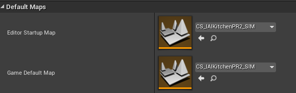

## CloudSim Level development with RobCoG project in Windows  

### CloudSim Level Development

* Add KnowrobManager,  LoggerManager, SymbolicManager, WordStateManager to the game world

* Create individual component for each actors in the level

  

* Create event monitor for the actor that you want to keep track of.  Choose the actor,  click `Add Component`and choose `ContactMonitorBox` or `ContactMonitorSphere` based on the shape of the object.

* Setup KnowrobManage. 

  * Enable flag `LoadValuesFromCommand`, 

  * Disable flag `Auto Convert World` 
  
  * Disable flag `ignore` 

  * No need to change KRServer IP and other configuration, they will be configured by cloudsim_k8s_lanuncher

    

* Generate SemanticMap OWL file

  * Click `Write Semantic Map Button` to generate Semantic Map OWL file. The OWL file will be under `RobCoG/SL`

  * The semantic map is used to be loaded in `knowrob_ameva`. Copy the SemanticMap OWL file in knowrob_ameva/maps and load the semantic map using query `am_load_semantic_map('utJDwYBP8CA', MapId)` 

  * Better to remove unnecessary individuals and classes in the SemanticMap OWL file. Bascially remove individuals and classes you don't use in the queries

    

### CloudSim Level Package Preparation

* Setup dependencies in RobCoG project. USemLog, Pixel Streaming Plugin are required for CloudSims

  ```
  "Plugins": [
      {
        "Name": "USemLog",
        "Enabled": true,
        "MarketplaceURL": "http://robcog.org/"
      },
      {
        "Name": "PixelStreaming",
        "Enabled": true
      }
    ]
  ```

* Setup dependencies in USemLog. UMongoC and UProtobuf are required. You can remove the others

  * USemLog.uplugin.

    ```
     "Plugins": [
          {
            "Name": "UMongoC",
            "Enabled": true
          },
          {
            "Name": "UProtobuf",
            "Enabled": true
          }
        ]
    ```

  * Build.cs MongoC, Protobuf, WebSockets are necessary, you can disable unused moduie

    ```
    PublicDependencyModuleNames.AddRange(
    			new string[]
    			{
    				"Core",				
    				"MongoC",						// SL_WITH_LIBMONGO_C                
    				"UProtobuf", 					// SL_WITH_PROTO
    				// ... add other public dependencies that you statically link with here ...
    			}
    )
    ```

* Choose the Level to package. Project Settings > Packaging, add the levels you want to build into `List of maps to include in a packaged build`

* Choose the default map. Project Settings > Default Maps, choose the level as `Editor Startup Map` and `Game Default Map`
  

* Save the project and move the project in Linux. It can only been compiled under Linux so far, Copy the project to Linux or commit the changes to github and download the project in Linux.

* You can clean unecessary stuff like Binaries, Saved and ..
