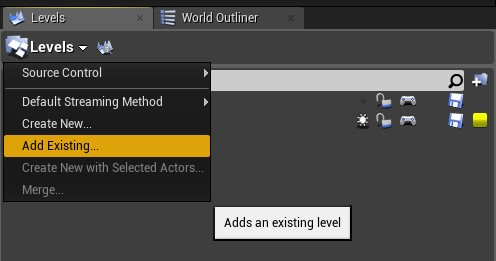
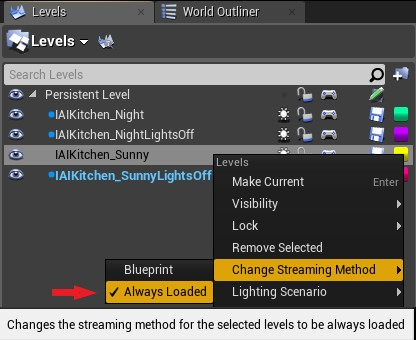
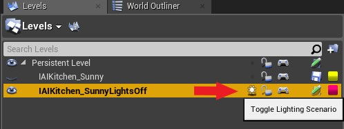
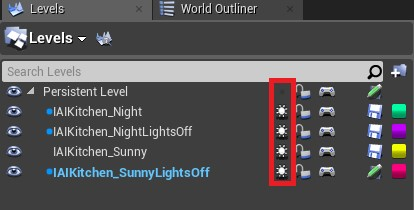

If you want to add different lighting scenarios, you need to add them as sub-levels. 

* Open the level editor. By Default, you will find the IAIKitchen_Sunny as a sublevel/Lighting scenario.

* Click "Add Existing Level" and choose the lighting scenario you want. 

* Right-click your scenario sub-level and Change Streaming Method to "Always Loaded". Then change the other sublevels to "Blueprint".

* Right-click your scenario sub-level > Lighting Scenario > Change to Lighting Scenario or toggle the light icon next to it.

* To Build the lighting, unhide all of your levels, and toggle "ON" all of the light icons of only the sublevels, then build. 

Notes: 

-You can only stream one lighting scenario sub-level at a time during gameplay. 

- To access the sublevel's blueprint, click the gamepad icon next to it. 

- If you want to add items to sublevel, not the persistent level, for e.g. add another light, you can either open the sub-level normally
as a level and make your changes, or you can select your sub-level, Right-click > Make Current. You will see the name of the level 
change at the bottom-right of your viewport. 

- You see all the items from your un-hidden levels in your World Outliner window, so be careful not to change something in another 
level accidentally.
If you want to be sure while making changes, you can hide all other levels, make your changes, then unhide them again. 
