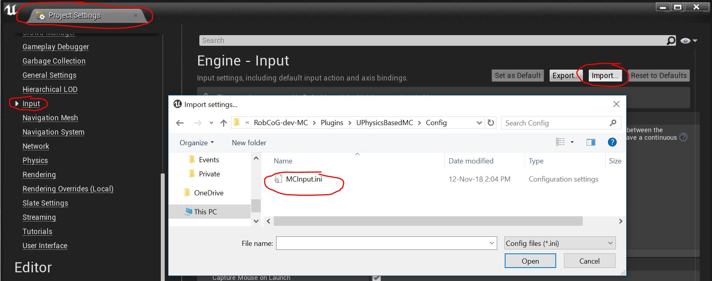

* Load input config from plugin:

* Add `MC Pawn` to world:

* Add the left and right `MC 6D Target`'s (inherits from [UMotionControllerComponent](https://api.unrealengine.com/INT/API/Runtime/HeadMountedDisplay/UMotionControllerComponent/index.html)):

* Add offset to the end effector (if needed):

