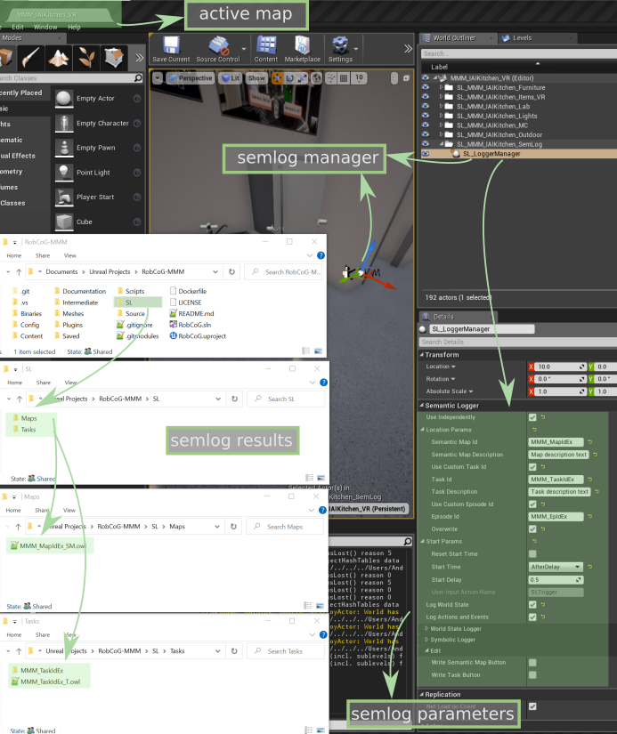
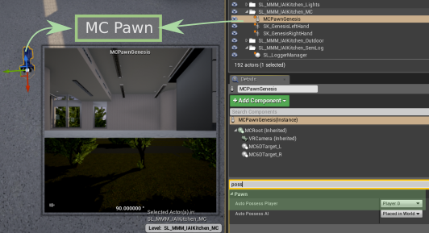
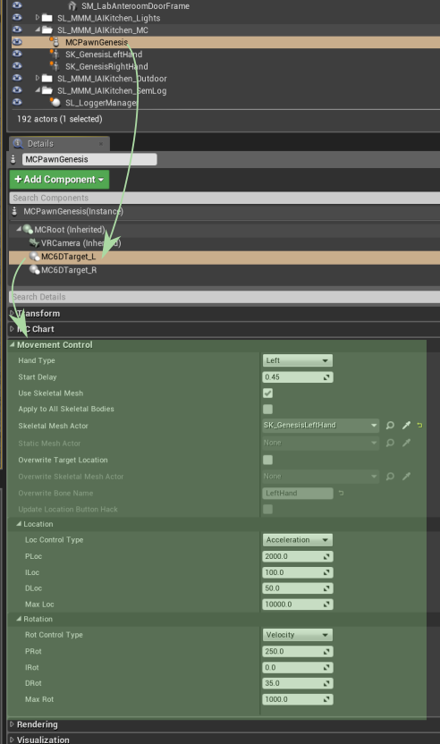

# MMM Project

## Setup

* clone https://github.com/robcog-iai/RobCoG with the following submodules:
  * `$ git clone -b master https://github.com/robcog-iai/RobCoG.git`
  * `$ git submodule update --init Plugins/UPhysicsBasedMC`
  * `$ git submodule update --init Plugins/USemLog`
  * `$ git submodule update --init Plugins/UMongoC`
* make sure the following plugins were cloned and are up to date (e.g. `cd Plugins/USemLog` and `git pull origin master`)  
  * `RobCoG/Plugins/UPhysicsBasedMC` - VR-enabled hand movements
  * `RobCoG/Plugins/USemLog` - semantic logger module for writing the episodic memories
  * `RobCoG/Plugins/UMongoC` - module for writing episodic memories to MongoDB
* install [MongoDB](https://docs.mongodb.com/manual/tutorial/install-mongodb-on-windows/)
* install Unreal Engine 4.27

## Project structure

* mmm main map location `RobCoG/Content/Maps/MMM/MMM_IAIKitchen_VR.umap`
* main map is always empty and only includes sublevels (see [robcog doc](Sublevels.md) and [ue doc](https://docs.unrealengine.com/4.26/en-US/Basics/Levels/LevelsWindow/))
* sublevels are prefixed with `SL_` (`RobCoG/Content/Maps/MMM/*`):
  * `SL_MMM_IAIKitchen_MC` - contains the motion controller (VR) controlled hands
  * `SL_MMM_IAIKitchen_Furniture` - contains the rigged furniture meshes
  * `SL_MMM_IAIKitchen_SemLog` - contains the semantic logger manager
  * `SL_MMM_IAIKitchen_Items_VR` - contains the items in the kitchen

## Getting started

* open `RobCoG/Content/Maps/MMM/MMM_IAIKitchen_VR.umap`
* set the semantic logger parameters:
    * `Use Independently` - if checked the manager will start on its own (e.g. will not be started by a third party API call e.g. knowrob/ros)
    * `Location Paramas` - the name of the map/task/episodes (custom names or autogenerated uuids)
    * `Start Params` - when to start logging (at beginplay, after a delay, manually etc.)

      
  
  
 

* set the motion controller (MC) interaction parameters:

   * make sure the pawn possesion is set to `Player 0`

      

   * set the left and right hand motion control PIDs:
        
         

      
