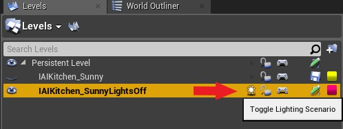
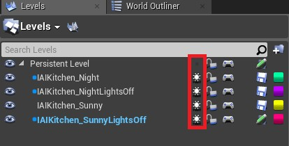
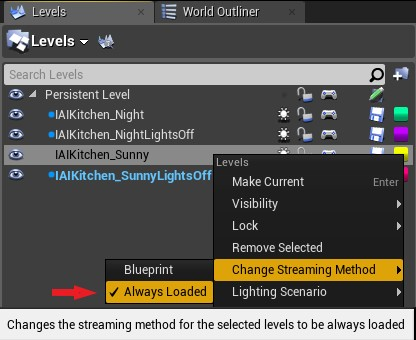

 
### To Load a Sublevel:

* Open your main/Persistent level.

* Then open the Level Editor. 

* Click *Add Existing Level* and choose the sublevel you want. 

### To add objects/lights to your sublevel:

If you want to add items to sublevel, not the main/persistent level:

* In the Level Editor: Select your sub-level, Right-click > *Make Current*. You will see the name of the level change at the bottom-right of your viewport. Now you can add your objects/lights.

##### *Important note!* 

- You see all the items from your un-hidden levels in your World Outliner window, so be careful not to change something in another level accidentally.
- If you want to be sure while making changes, you can hide all other levels, make your changes, then unhide them again. 
Or you can open the sub-level normally as a level and make your changes. 

### For Lighting Scenarios:

If you want to add different lighting scenarios, you need to add them as sublevels and then specify to Unreal that this is a lighting scenario so it should build and use the lights from it. To do this:

* Prepare your meshes in one level without lighting. This will be your main/persistent level.

* Then place your lights in a seperate level. You can create a new level or Add an existing one, as shown above.

* Right-click your sub-level > *Lighting Scenario* > *Change to Lighting Scenario*. Or toggle the light icon next to it.

#### To Build the lighting:

* Unhide all of your levels, and toggle "ON" all of the light icons of only the sublevels, then build. 

### To Set which sublevels should run on Play:

* Right-click the scenario/sub-level you want to run on Play > *Change Streaming Method* > *Always Loaded*. Then change the other sublevels you don't want to Play to *Blueprint*.

### Notes: 

-You can only stream one lighting scenario sub-level at a time during gameplay. 

-To access the sublevel's blueprint, click the gamepad icon next to it. 

### For MC:

To add the Motion Controller to a level, you also need to add it as a sublevel: 

* In the level editor> *Add Existing* > *IAIKitchen_MC* 

* Right-Click on *IAIKitchen_MC* > *Change Streaming Method* > *Always Loaded.

