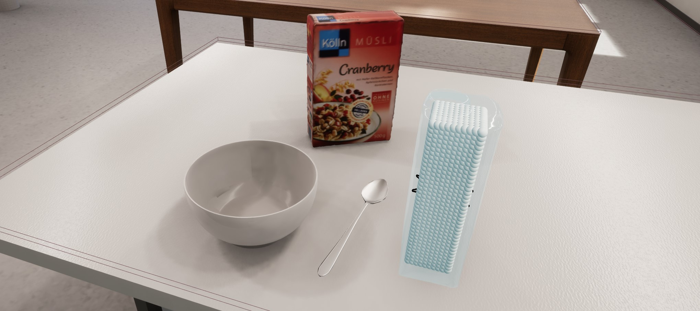

[](https://vimeo.com/246255922)

# RobCoG - **Rob**ot **Co**mmonsense **G**ames 

Equipping robots with commonsense and naive physics knowledge.

# FleX - particle based simulation

Branch using FleX in RobCoG.

# Submodules

 * ```Plugins``` are added as submodules.

```git submodule update --init --recursive```

### Engine Version 4.17 

# Naming Convention

| Asset Type               | Asset Name                                                 |
| -----------------------  | ---------------------------------------------------------- |
| Flex Container           | FC_Bob                                                     |
| Particle System (Emitter)| FE_Bob                                                     |
| Spawn Flex Shape         | FSM_Cylinder_10_20                                         |
