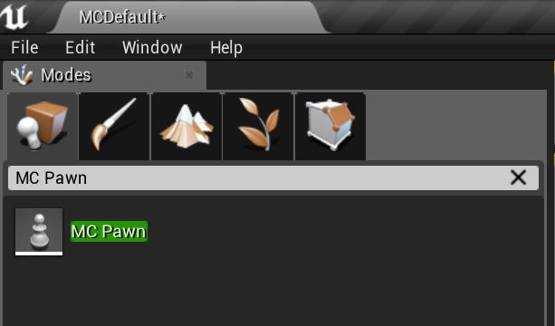
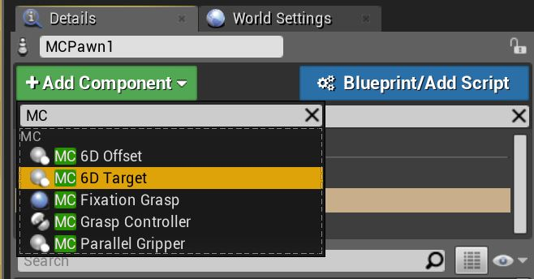
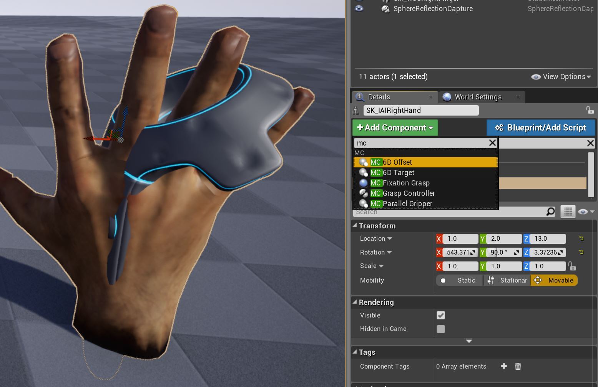

# RobCoG - **Rob**ot **Co**mmonsense **G**ames

Examples project using the [UPhysicsBasedMC](https://github.com/robcog-iai/UPhysicsBasedMC) plugin.

Supported engine version: **UE 4.20**

## Usage:

* Load input config from plugin:

* Add `MC Pawn` to world:

* Add the left and right `MC 6D Target`'s (inherits from [UMotionControllerComponent](https://api.unrealengine.com/INT/API/Runtime/HeadMountedDisplay/UMotionControllerComponent/index.html)):

* Add offset to the end effector (if needed):

