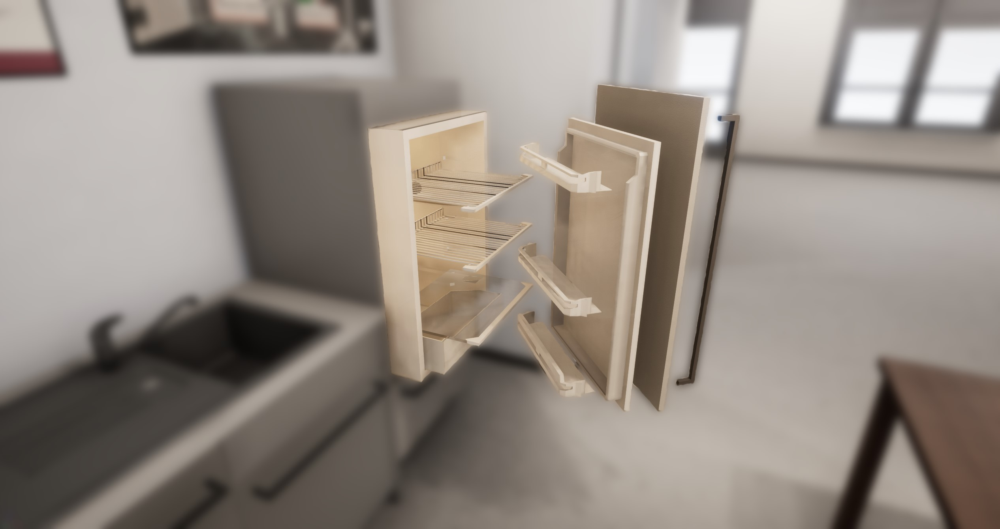

[](http://robcog.org/)

# RobCoG - **Rob**ot **Co**mmonsense **G**ames

Environment branch of RobCoG. No functionalities just assets.

Supported engine version: **UE 4.20**

## Private Submodules

If you have access to the private assets update the submodules as well:

```
git submodule update --init --recursive
```

if the repository is not already cloned, you can do this in one step

```
git clone --recursive -b dev-env https://github.com/robcog-iai/RobCoG.git
```
