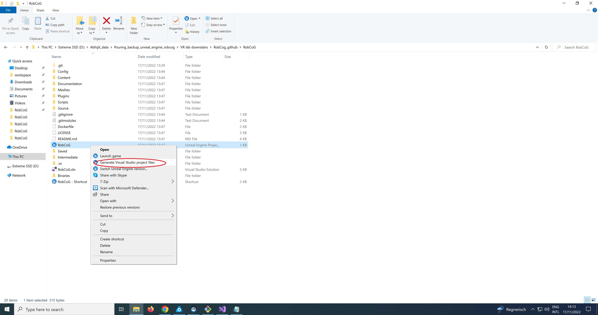
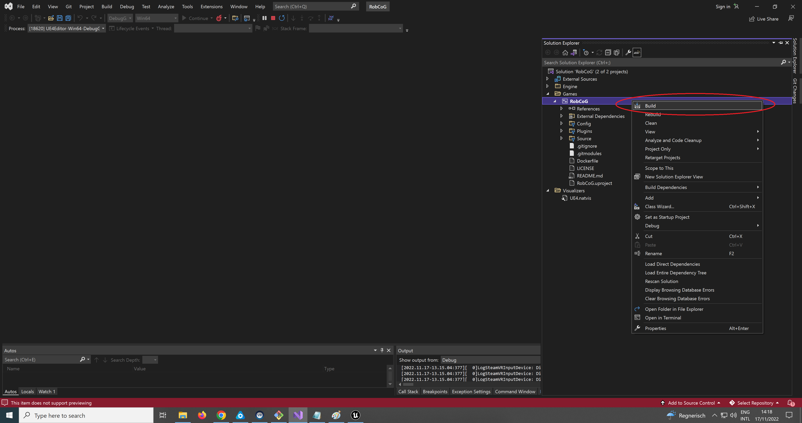
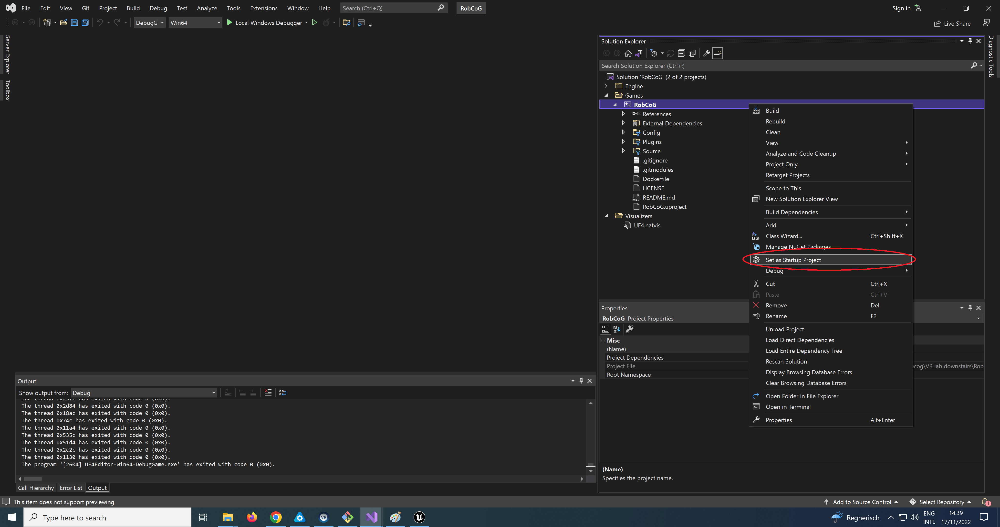
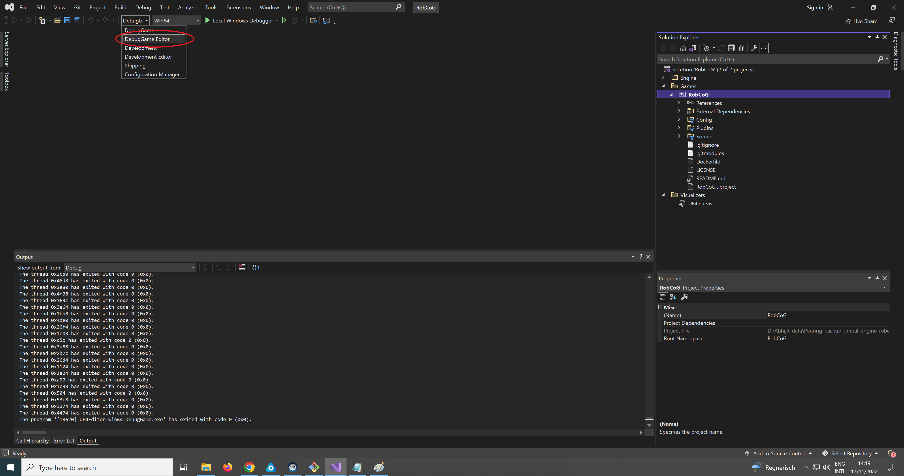

[](http://robcog.org/)
### Stable Masterbranch for new features please take a look into the dev branch.
### UE Version: **4.27**

### Environments


### Capabilities


### C++ Coding Standards:

 * [Unreal Code Standard](https://docs.unrealengine.com/en-us/Programming/Development/CodingStandard)
 * [Splash Damage Standard](https://github.com/splash-damage/coding-standards)

### Asset Naming and Creation Convention:

 * [Naming convention](https://github.com/Allar/ue4-style-guide)
 * Due to the connection with `KnowRob` currently all the models are sandboxed and self contained
   * They are always located in a top folder called `Models`
   * The leaf folder is always the KnowRob class name:
     * `Models/IAIKitchen/IAIFurniture/IAIDiningTable/*`
      * `SM_IAIDiningTable`
      * `T_IAIDiningTable_N`
      * `T_IAIDiningTable_D`
      * `T_IAIDiningTable_S`
      * `T_IAIDiningTableTop`
      * `T_IAIDiningTableTop_S`
      * `M_IAIDiningTable`
      * `M_IAIDiningTableTop`
      * `M_IAIDiningTableFeet`
      * `..`


### Submodules

The project points to various submodules (plugins, assets, private assets etc.). If you want to clone the project with submodules, see the following git commands:

* after cloning the project, clone specific submodules:

```bash
$ git submodule update --init Content/Private
$ git submodule update --init Plugins/USemLog
$ git submodule update --init Plugins/UMongoC
[..]
```

* all submodules:

```bash
$ git submodule update --init --recursive
```

* or clone the repository with all the submodules:

```
$ git clone --recurse-submodules -b master https://github.com/robcog-iai/RobCoG.git
```

### Build and Debug Project with Microsoft Visual Studio
1. First step is to generate visual studio files. Right click on RobCog UE file and select "generate visual studio files"

2. Now Along with few folders, there will be RobCog.sln file in the directory. Open it with Visual Studio.
3. Once the RobCog project is open in Visual Studio, right click on RobCog and build the project.

4. Once build process is finished, right click on RobCog again and select "Set as Startup Project"

5. At last, select "DebugGame Editor" option and press "Local Windows Debugger" button.

5. Now the world of RobCog will be available in UE in Debug mode!

### Documentation

* [MC](Documentation/MC.md)

* [Sublevels](Documentation/Sublevels.md)

* [Cloudsim](Documentation/CloudsimSetup.md)

### Related publications

```bibtex
@inproceedings{haidu21ameva2,
  author    = {Andrei Haidu and Michael Beetz},
  title     = {Automated acquisition of structured, semantic models of manipulation activities from human VR demonstration},  
  booktitle = {IEEE International Conference on Robotics and Automation (ICRA)},
  year      = {2021},
  address   = {Xi'an, China},
  pages     = {9460-9466},
  url       = {https://doi.org/10.1109/ICRA48506.2021.9562016},
  note      = {Finalist for Best Paper Award on Human-Robot Interaction},
}

@inproceedings{haidu21amevacv,
 title      = {Knowledge-Enabled Generation of Semantically Annotated Image Sequences of Manipulation Activities from VR Demonstrations},
 author     = {Andrei Haidu and Xiaoyue Zhang and Michael Beetz}, 
 booktitle  = {Computer Vision Systems},
 year       = {2021},
 publisher  = {Springer International Publishing},
 pages      = {130--143},
 isbn       = {978-3-030-87156-7},
 url        = {https://doi.org/10.1007/978-3-030-87156-7_11}
}

@inproceedings{haidu19ameva,
  author    = {Andrei Haidu and Michael Beetz},
  title     = {Automated Models of Human Everyday Activity based on Game and Virtual Reality Technology},
  booktitle = {2019 International Conference on Robotics and Automation (ICRA)},
  year      = {2019},
  pages     = {2606-2612},
  url       = {https://doi.org/10.1109/ICRA.2019.8793859}
}

@inproceedings{haidu18krsim,
  author    = {Andrei Haidu and Daniel Bessler and Asil Kaan Bozcuoglu and Michael Beetz},
  title     = {KnowRob_SIM - Game Engine-Enabled Knowledge Processing Towards Cognition-Enabled Robot Control},
  booktitle = {{IEEE/RSJ} International Conference on Intelligent Robots and Systems, {IROS} 2018, Madrid, Spain, October 1-5, 2018},
  year      = {2018},
  url       = {https://doi.org/10.1109/IROS.2018.8593935}
}
```
