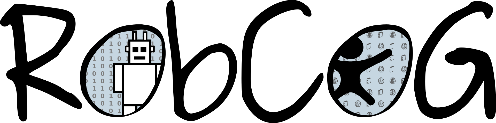

[](http://robcog.org/)

### UE Version: **4.23**

### Capabilities


### C++ Coding Standards:

 * [Unreal Code Standard](https://docs.unrealengine.com/en-us/Programming/Development/CodingStandard)
 * [Splash Damage Standard](https://github.com/splash-damage/coding-standards)

### Asset Naming and Creation Convention:

 * [Naming convention](https://github.com/Allar/ue4-style-guide)
 * Due to the connection with `KnowRob` currently all the models are sandboxed and self contained
   * They are always located in a top folder called `Models`
   * The leaf folder is always the KnowRob class name:
     * `Models/IAIKitchen/IAIFurniture/IAIDiningTable/*`
      * `SM_IAIDiningTable`
      * `T_IAIDiningTable_N`
      * `T_IAIDiningTable_D`
      * `T_IAIDiningTable_S`
      * `T_IAIDiningTableTop`
      * `T_IAIDiningTableTop_S`
      * `M_IAIDiningTable`
      * `M_IAIDiningTableTop`
      * `M_IAIDiningTableFeet`
      * `..`


### Submodules

The project points to various submodules (plugins, assets, private assets etc.). If you want to clone the project with submodules, see the following git commands:

* after cloning the project, clone specific submodules:

```bash
$ git submodule update --init Content/Private
$ git submodule update --init Plugins/USemLog
$ git submodule update --init Plugins/UMongoC
[..]
```

* all submodules:

```bash
$ git submodule update --init --recursive
```

* or clone the repository with all the submodules:

```
$ git clone --recursive -b master https://github.com/robcog-iai/RobCoG.git
```

### Documentation

* [MC](Documentation/MC.md)

* [Sublevels](Documentation/Sublevels.md)

* [Cloudsim](Documentation/CloudsimSetup.md)

### Related publications

```bibtex
@inproceedings{haidu21ameva2,
   title={Automated acquisition of structured, semantic models of manipulation activities from human VR demonstration}, 
   author={Andrei Haidu and Michael Beetz},
   booktitle = {IEEE International Conference on Robotics and Automation (ICRA)},
   year={2021},
   address = {Xi'an, China},
   note = {Accepted for publication, available at \url{https://arxiv.org/pdf/2011.13689.pdf}},
}

@inproceedings{haidu19ameva,
  author    = {A. {Haidu} and M. {Beetz}},
  title     = {Automated Models of Human Everyday Activity based on Game and Virtual Reality Technology},
  booktitle = {2019 International Conference on Robotics and Automation (ICRA)},
  year      = {2019},
  pages     = {2606-2612},
  url       = { https://doi.org/10.1109/ICRA.2019.8793859}
}

@inproceedings{haidu18krsim,
  author    = {Andrei Haidu, Daniel Bessler, Asil Kaan Bozcuoglu, Michael Beetz},
  title     = {KnowRob_SIM - Game Engine-Enabled Knowledge Processing Towards Cognition-Enabled Robot Control},
  booktitle = {2018 {IEEE/RSJ} International Conference on Intelligent Robots and Systems, {IROS} 2018, Madrid, Spain, October 1-5, 2018},
  year      = {2018},
  url       = {https://doi.org/10.1109/IROS.2018.8593935}
}
```
